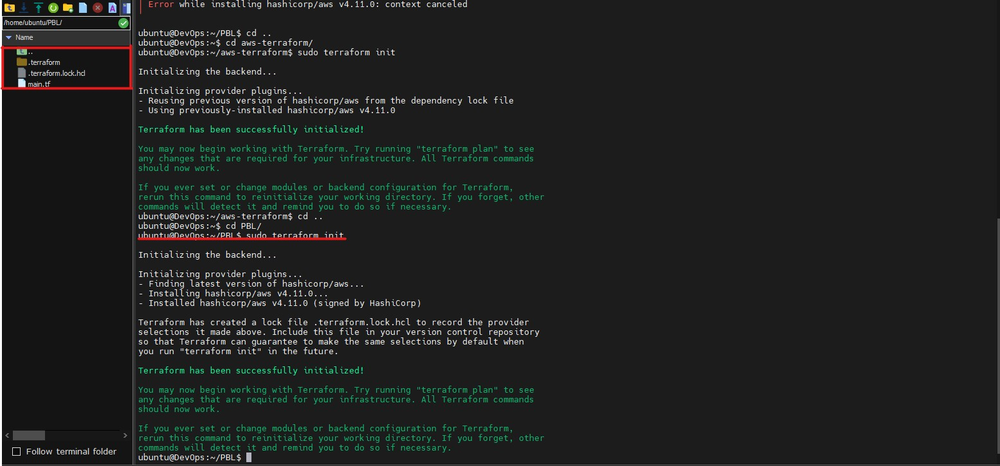
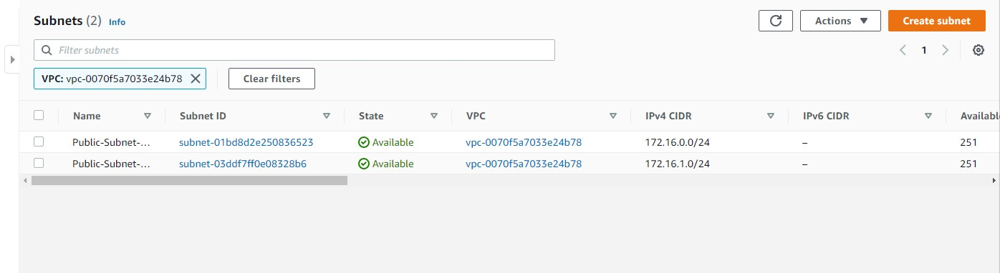
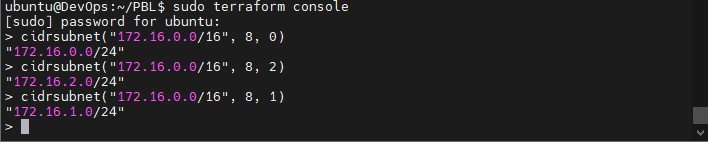
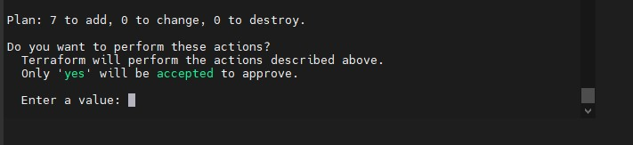

# AUTOMATE INFRASTRUCTURE WITH IAC USING TERRAFORM PART 1 #

We will use Infrastructure Automation tool to implement IAC (Infrastructure as a Code) the network infrastructure above.

Prerequisites for this Project
1. Ensure you have at least Python3.6 installed 
1. Create an IAM account from your main account with **AdministratorAccess** permission
1. Create an s3 bucket
1. Configure programmatic access from your workstation to connect to AWS using the access keys copied above and a Python SDK (boto3).

Install Python with:
~~~
sudo apt install python3
~~~
Install botox3
~~~
 sudo python -m venv .venv
...
sudo . .venv/bin/activate

sudo python -m pip install boto3
~~~

Test the Programatic account you created 
~~~
import boto3
s3 = boto3.resource('s3')
for bucket in s3.buckets.all():
    print(bucket.name)
~~~
The above should display the name of your s3 bucket

Create a folder called PBL
Create a file in the folder, name it main.tf
~~~
sudo mkdir PBL
sudo touch PBL/main.tf
~~~
### Provider and VPC resource section ###
- Add AWS as a provider, and a resource to create a VPC in the main.tf file.
- Provider block informs Terraform that we intend to build infrastructure within AWS.
- Resource block will create a VPC

~~~
provider "aws" {
  region = "us-east-1"
}

# Create VPC
resource "aws_vpc" "PRJ16-vpc" {
  cidr_block                     = "172.16.0.0/16"
  enable_dns_support             = "true"
  enable_dns_hostnames           = "true"
  enable_classiclink             = "false"
  enable_classiclink_dns_support = "false"
}
~~~

### Propare your PBL folder for Terraform
~~~
sudo terraform init
~~~
This downloads all required terraform plugins for the selected provider (aws in this case) and provisioner

Then run
~~~
sudo terraform plan
~~~
This will displan what the main.tf file will produce as output in our specified region

If satisfied with the output, run
~~~
sudo terraform apply
~~~
to build the infrastructure described in the main.tf file

### Let us create the first 2 public subnets. ###
Add below to the main.tf file

~~~
# Create public subnets1
    resource "aws_subnet" "public1" {
    vpc_id                     = aws_vpc.PRJ16-vpc.id
    cidr_block                 = "172.16.0.0/24"
    map_public_ip_on_launch    = true
    availability_zone          = "us-east-1a"

}

# Create public subnet2
    resource "aws_subnet" "public2" {
    vpc_id                     = aws_vpc.PRJ16-vpc.id
    cidr_block                 = "172.16.1.0/24"
    map_public_ip_on_launch    = true
    availability_zone          = "us-east-1b"
}
~~~
The *vpc_id* tells Terraform which VPC to create the subnets

Then run terraform plan and terraform apply 
~~~
sudo terraform plan
~~~
When satisfied 
~~~
sudo terraform apply
~~~

Go to your AWS console to varify the result

So values were hard-coded, this will present problems moving forward, let is refactor the codes

### FIXING THE PROBLEMS BY CODE REFACTORING ###

Let us declare these variable as used in our IaC

~~~
 variable "region" {
        default = "us-east-1"
 }

 }
 variable "region" {
        default = "us-east-1"
}
variable "vpc_cidr" {
        default = "172.16.0.0/16"
}

variable "enable_dns_support" {
        default = "true"
}

variable "enable_dns_hostnames" {
        default ="true" 
}

variable "enable_classiclink" {
        default = "false"
}

variable "enable_classiclink_dns_support" {
        default = "false"
}

provider "aws" {
    region = var.region
}

# Create VPC
resource "aws_vpc" "main" {
    cidr_block                     = var.vpc_cidr
    enable_dns_support             = var.enable_dns_support 
    enable_dns_hostnames           = var.enable_dns_support
    enable_classiclink             = var.enable_classiclink
    enable_classiclink_dns_support = var.enable_classiclink
~~~
Terraform uses **Data Source** to pull data from providers, here we will use data source to pull a list of availability zones from a specific AWS region

~~~
  # Get list of availability zones
data "aws_availability_zones" "available" {
state = "available"
}
~~~

To make use of this new data resource, we will need to introduce a count argument in the subnet block: Something like this.
~~~
  # Create public subnet1
  resource "aws_subnet" "public" { 
      count                   = 2
      vpc_id                  = aws_vpc.PRJ16-vpc.id
      cidr_block              = "172.16.1.0/24"
      map_public_ip_on_launch = true
      availability_zone       = data.aws_availability_zones.available.names[count.index]

    }
~~~
- The count tells us that we need 2 subnets. Therefore, Terraform will invoke a loop to create 2 subnets.
- The data resource will return a list object that contains a list of AZs. Internally, Terraform will receive the data like this
~~~
["us-east-1a", "us-east-1b"]
~~~
Each of them is an index, the first one is index 0, while the other is index 1. If the data returned had more than 2 records, then the index numbers would continue to increment.

Therefore, each time Terraform goes into a loop to create a subnet, it must be created in the retrieved AZ from the list. Each loop will need the index number to determine what AZ the subnet will be created. That is why we have data.aws_availability_zones.available.names[count.index] as the value for availability_zone. When the first loop runs, the first index will be 0, therefore the AZ will be eu-central-1a. The pattern will repeat for the second loop.

But we still have a problem. If we run Terraform with this configuration, it may succeed for the first time, but by the time it goes into the second loop, it will fail because we still have cidr_block hard coded. The same cidr_block cannot be created twice within the same VPC. So, we have a little more work to do.

### **Let’s make cidr_block dynamic.** ###
We will introduce a function cidrsubnet() to make this happen. It accepts 3 parameters. Let us use it first by updating the configuration, then we will explore its internals

~~~
    # Create public subnet1
 resource "aws_subnet" "public" { 
     count                   = 2
     vpc_id                  = aws_vpc.PRJ16-vpc.id
     cidr_block              = cidrsubnet(var.vpc_cidr, 8 , count.index)
     map_public_ip_on_launch = true
     availability_zone       = data.aws_availability_zones.available.names[count.index]

 }
 ~~~
 
 A closer look at cidrsubnet – this function works like an algorithm to dynamically create a subnet CIDR per AZ. Regardless of the number of subnets created, it takes care of the cidr value per subnet.

Its parameters are cidrsubnet(prefix, newbits, netnum)

The prefix parameter must be given in CIDR notation, same as for VPC.
The newbits parameter is the number of additional bits with which to extend the prefix. For example, if given a prefix ending with /16 and a newbits value of 8, the resulting subnet address will have length /24
The netnum parameter is a whole number that can be represented as a binary integer with no more than newbits binary digits, which will be used to populate the additional bits added to the prefix

We can test this on terraform console thus:
- On the terminal, run terraform console
- type cidrsubnet("172.16.0.0/16", 8, 0)
- Hit enter
- See the output
- Keep change the numbers and see what happens.
- To get out of the console, type exit
 
See result below:

## Remove hard coded count values ##
We can use *length* to count the number elements of a string, map or list. Thus we can know the number of AZs in a region
~~~
lenth(data.aws_availability_zones.available.names)
~~~
will produce the number of AZs 

We can now have:
~~~
# Create public subnet1
resource "aws_subnet" "public" { 
    count                   = length(data.aws_availability_zones.available.names)
    vpc_id                  = aws_vpc.PRJ16-vpc.id
    cidr_block              = cidrsubnet(var.vpc_cidr, 8 , count.index)
    map_public_ip_on_launch = true
    availability_zone       = data.aws_availability_zones.available.names[count.index]

}
~~~
If there are more than 2 AZs in this zone, our IaC will create more than 2 subnets which is not meeting out business requirement.

**Now, let us fix this.**

Declare a variable to store the desired number of public subnets, and set the default value
~~~
variable "preferred_number_of_public_subnets" {
  default = 2
}
~~~
Next, update the count argument with a condition. Terraform needs to check first if there is a desired number of subnets. Otherwise, use the data returned by the length function. See how that is presented below.
~~~
# Create public subnets
resource "aws_subnet" "public" {
  count  = var.preferred_number_of_public_subnets == null ? length(data.aws_availability_zones.available.names) : var.preferred_number_of_public_subnets   
  vpc_id = aws_vpc.PRJ16-vpc.id
  cidr_block              = cidrsubnet(var.vpc_cidr, 8 , count.index)
  map_public_ip_on_launch = true
  availability_zone       = data.aws_availability_zones.available.names[count.index]

}
~~~

This is what it means:
- The first part var.preferred_number_of_public_subnets == null checks if the value of the variable is set to null or has some value defined.
- The second part ? and length(data.aws_availability_zones.available.names) means, if the first part is true, then use this. In other words, if preferred number of public subnets is null (Or not known) then set the value to the data returned by lenght function.
- The third part : and var.preferred_number_of_public_subnets means, if the first condition is false, i.e preferred number of public subnets is not null then set the value to whatever is definied in var.preferred_number_of_public_subnets

Our new main.tf file should look like this now
~~~
# Get list of availability zones
data "aws_availability_zones" "available" {
state = "available"
}

variable "region" {
      default = "us-east-1"
}

variable "vpc_cidr" {
    default = "172.16.0.0/16"
}

variable "enable_dns_support" {
    default = "true"
}

variable "enable_dns_hostnames" {
    default ="true" 
}

variable "enable_classiclink" {
    default = "false"
}

variable "enable_classiclink_dns_support" {
    default = "false"
}

  variable "preferred_number_of_public_subnets" {
      default = 2
}

provider "aws" {
  region = var.region
}

# Create VPC
resource "aws_vpc" "PRJ16-vpc" {
  cidr_block                     = var.vpc_cidr
  enable_dns_support             = var.enable_dns_support 
  enable_dns_hostnames           = var.enable_dns_support
  enable_classiclink             = var.enable_classiclink
  enable_classiclink_dns_support = var.enable_classiclink

}

# Create public subnets
resource "aws_subnet" "public" {
  count  = var.preferred_number_of_public_subnets == null ? length(data.aws_availability_zones.available.names) : var.preferred_number_of_public_subnets   
  vpc_id = aws_vpc.PRJ16-vpc.id
  cidr_block              = cidrsubnet(var.vpc_cidr, 8 , count.index)
  map_public_ip_on_launch = true
  availability_zone       = data.aws_availability_zones.available.names[count.index]

}
~~~

### Introducing variables.tf & terraform.tfvars ###

Instead of havng a long lisf of variables in main.tf file, we can actually make our code a lot more readable and better structured by moving out some parts of the configuration content to other files.

- We will put all variable declarations in a separate file
- And provide non default values to each of them
1. Create a new file and name it variables.tf
1. Copy all the variable declarations into the new file.
1. Create another file, name it terraform.tfvars
1. Set values for each of the variables.

We have these files now

**main.tf**

**terraform.tfvars**

**variables.tf**

If we pass *null* value to the preferred_number_of_public_subnets variable, terraform will create a number of subnets that is equal to the number of AZs in our rgion, in this case (us-east-1), six (us-east-1a to us-east-1f).

